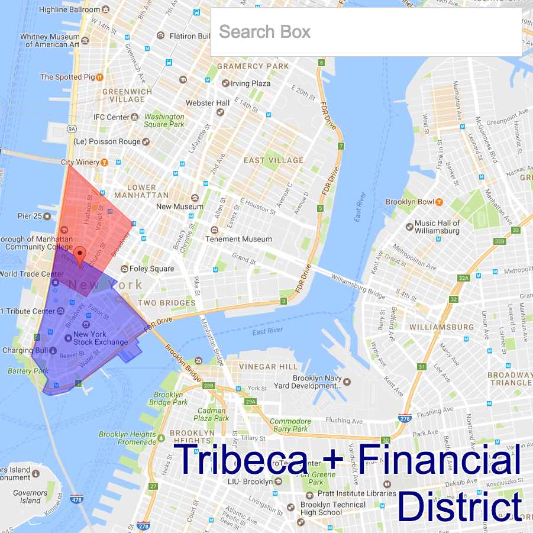

# [FindThisHood](https://www.findthishood.com)
The application requests current location to show a user's neighborhood.  Also, users can search locations to determine other locations' neighborhoods.



## Technologies
Currently, FindThisHood is entirely a front-end application.  It uses JavaScript, React, and Google Maps API for its functionalities.

## Add/Fix Your Neighborhood
If your neighborhood is not represented or you think the boundaries are incorrect, submit a pull request with the appropriate coordinates.  Neighborhoods are contained within the file `lib/util/locations.js`.  A neighborhood's coordinates are inputted to that file in the following format:

```
"Nolita": [
  {lat: 40.7251, lng: -73.9953},
  {lat: 40.7242, lng: -73.9926},
  {lat: 40.7194, lng: -73.9944},
  {lat: 40.7195, lng: -73.9946},
  {lat: 40.7211, lng: -73.9982}
],
```

To plot coordinates, console log coordinates by dragging the marker to outline a neighborhood at [this](http://jsfiddle.net/salman/ZW9jP/4/) link.  Any improvements to this process are appreciated.
